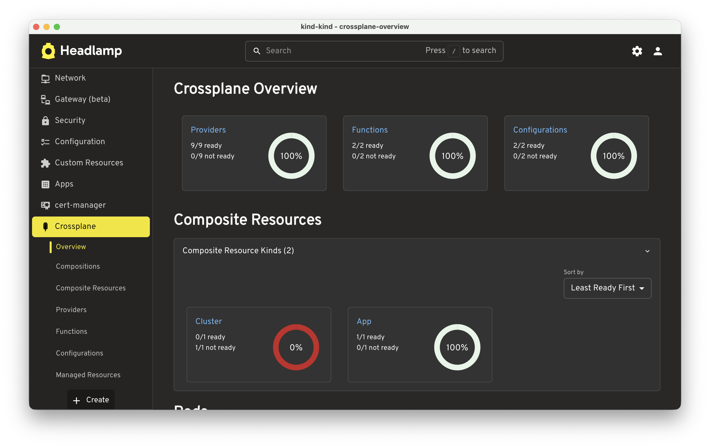
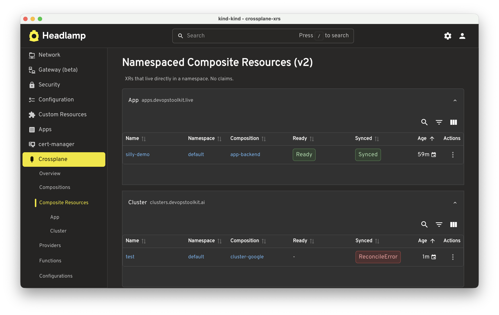
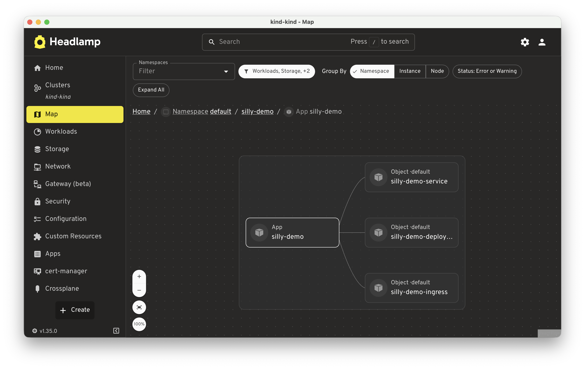
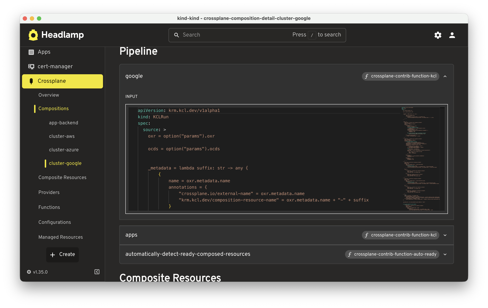

[](https://artifacthub.io/packages/search?repo=headlamp-plugin-crossplane)

# headlamp-plugin-crossplane

A [Headlamp](https://headlamp.dev) plugin that surfaces
[Crossplane](https://crossplane.io) resources in the Kubernetes UI. Browse
Providers, Functions, Configurations, Composite Resources, Claims, Compositions,
and Managed Resources - all without leaving Headlamp.

## Features

- **Overview dashboard** - health tiles for Providers, Functions,
  Configurations, and every XR kind, plus live Crossplane pod status grouped by
  system/provider/function
- **Composite Resources & Claims** - list and detail views for all
  dynamically-defined XR kinds and their claims, with Ready/Synced status chips
  and composition linkage
- **Compositions** - browse all Compositions with a visual map showing which XRs
  and Managed Resources each one owns
- **Package management** - list and detail pages for Providers, Functions, and
  Configurations including revision history and installed object tables

## Screenshots

### Overview dashboard



### Composite Resources list



### Composition map view



### Composition detail page



## Installation

Install via the Headlamp plugin catalog, or manually:

1. Download the latest `.tar.gz` from the [Releases](../../releases) page.
2. Extract into your Headlamp plugins directory (`~/.config/Headlamp/plugins/`
   on macOS/Linux).
3. Restart Headlamp.

## Development

```bash
npm install
npm run start    # watch mode - hot reload via Headlamp desktop app
npm run build    # production build into dist/
npm run test     # run vitest tests
npm run lint     # ESLint
```

Hot reload requires the Headlamp desktop app to be running. The plugin directory
it watches is `~/.config/Headlamp/plugins/` (macOS/Linux).

## Resources

- [Headlamp Plugin Docs](https://headlamp.dev/docs/latest/development/plugins/)
- [Crossplane Docs](https://docs.crossplane.io)
- [Headlamp Plugin API Reference](https://headlamp.dev/docs/latest/development/api/)
